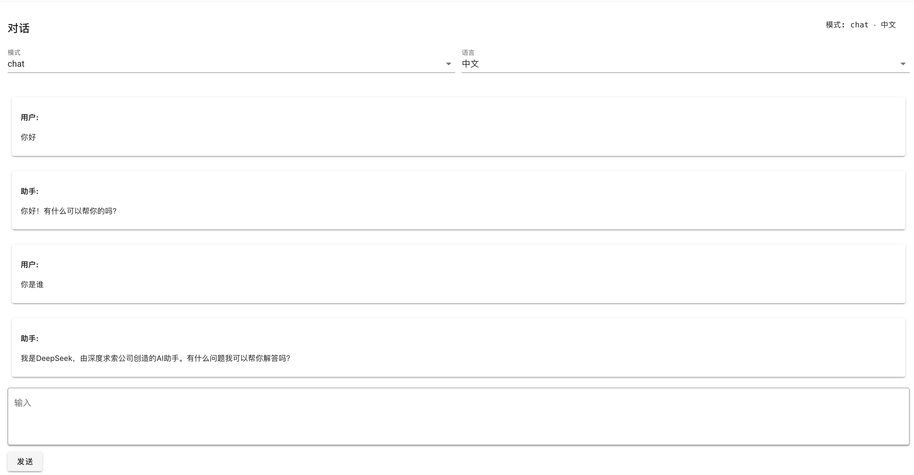
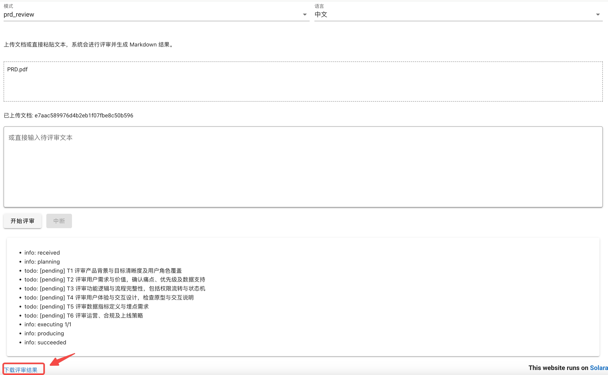

# 文档评审分析 Agent（Review Analysis Agent）

## 项目作用

Review Analysis Agent 是一个单体 Web 应用（同进程提供前端 + 后端），用于：

- `chat`：与大模型进行多轮对话
- `prd_review`：对 PRD（产品需求文档）进行评审
- `trd_review`：对 TRD（技术方案文档）进行评审
- `tc_review`：对测试用例文档进行评审

评审模式支持文本输入或上传文档；文档与评审结果会在本地落盘并设置 1 天 TTL（过期后不可用/会被清理）。前端使用 Solara 提供类似 ChatGPT 的中文界面，后端使用 FastAPI 暴露 REST API，同时将 Solara 挂载到根路径提供 UI。

demo 展示：




## 架构

**整体结构**

- Solara UI：`src/cli/app.py`
- FastAPI API：`src/api/routes_*.py`
- Agent（Plan-and-Execute 评审）：`src/agent/review_handler.py`
- 文档解析：`src/utils/document_parser.py`（PDF/Office 走 DocMind；md/txt 直接读取）
- 文件存储（TTL 1 天）：`src/utils/file_store.py`（documents/reviews + manifests）

**目录结构（核心）**

```text
src/
  cli/
    app.py                 # Solara UI 入口
    server.py              # FastAPI app，挂载 Solara + /api
  api/
    routes_sessions.py     # sessions API
    routes_documents.py    # documents API（上传）
    routes_runs.py         # runs/reviews API（异步执行 + 事件）
    routes_artifacts.py    # artifacts API（下载评审结果）
  agent/
    chat_handler.py        # chat 服务
    review_handler.py      # Plan-and-Execute 评审服务
  prompt/
    registry.py            # 模式 → prompt 映射
    templates/             # chat/prd/trd/tc 四套内置 prompt
  utils/
    document_parser.py     # 文档解析（DocMind 可选）
    aili_doc_parser.py     # 阿里云 DocMind SDK 封装
    file_store.py          # TTL 文件存储与 manifests
  datas/
    documents/             # 上传文档落盘
    reviews/               # 评审 Markdown 落盘
    manifests/             # 文件元信息索引（过期时间等）
tests/
```

## 安装

项目依赖通过 `pyproject.toml` 管理，推荐使用 uv。

```bash
uv sync --all-extras
```

## 配置

模型配置在 `src/config.yaml`：

- `models.chat_model.base_url`：兼容 OpenAI API 的服务地址
- `models.chat_model.api_key`：API Key
- `models.chat_model.model`：模型名称

文档解析（DocMind）默认开启：`DOCMIND_ENABLED=1`。如果不使用 DocMind，可在启动前设置：

```bash
export DOCMIND_ENABLED=0
```

当 `DOCMIND_ENABLED=1` 且上传了非 `.md/.txt` 文档时，会尝试调用阿里云 DocMind SDK（需要本机/环境具备阿里云凭证配置）。

## 启动

启动开发服务（UI + API）：

```bash
uv run uvicorn src.cli.server:app --host 127.0.0.1 --port 8000
or python3 -m src.main
```

- UI：打开 `http://127.0.0.1:8000/`
- OpenAPI：`http://127.0.0.1:8000/api/docs`


## 常用开发命令

```bash
uv run ruff check .
uv run mypy .
uv run pytest
```


